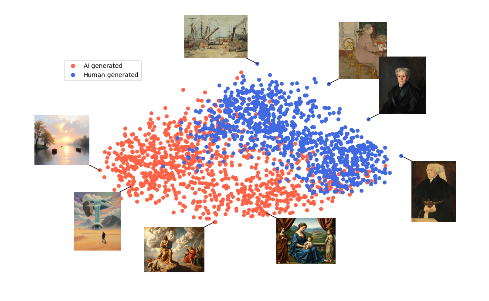
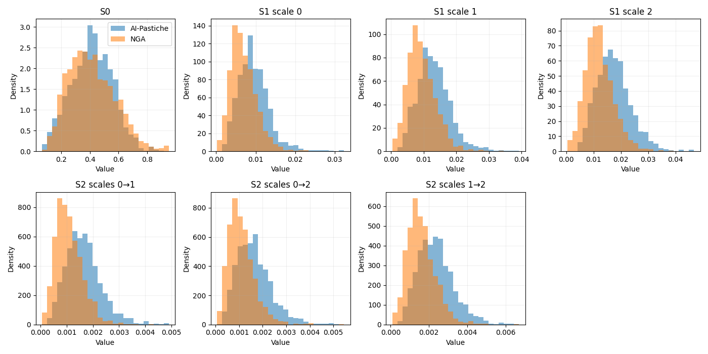
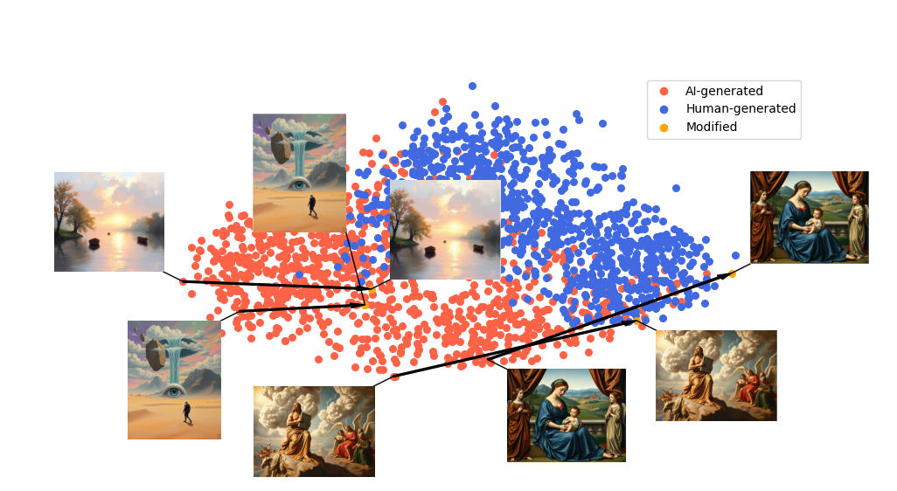

# Interpreting the separability of Human and AI images in CLIP's embedding space

This notebook is a companion repository of the article "On the Separation of Human and AI-Generated
Images in CLIP Embedding Space". 

We address a previously unreported phenomenon in CLIP representations:
human and AI-generated paintings spontaneously separate along the dominant
principal directions of their joint embedding distribution, without any
supervised objective designed to distinguish the two classes. Our aim is to interpret it:
we seek to identify the visual information underlying the separation and to
trace it back from the embedding space to the image domain.

  

We pursue this objective through a progressive investigation combining
interpretable image representations with gradient-based inversion, used
systematically as an experimental probe of the relationships identified in
feature space. Robustness experiments and increasingly expressive
statistical descriptors progressively rule out several intuitive
explanations based on global image properties and simple local statistics,
and point instead to distributed multiscale image structure. Multiscale
scattering provides the most informative interpretable representation
considered, but offers only a partial account of the phenomenon.

The following picture describes the distribution of scattering features realtive
to AI-generated images of AI-Pastiche, and Human paintings of the National Gallery
of Art of Washington.

  

Direct inversion provides a complementary and striking observation:
substantial displacements along the dominant CLIP directions can be induced
by image perturbations that remain nearly imperceptible to human observers,
showing that the directions involved in the separation are highly sensitive
to image variations with very low perceptual salience for humans. 

  

Taken
together, these results reveal a significant difference between the visual
evidence reflected in CLIP representations and that readily accessible to
human perception, raising broader questions about the relationship between
artificial and human vision and, ultimately, between artificial and human
aesthetic judgment.

## Code and Notebooks

* <a href="Detection_of_AI_generated_paintins.ipynb">Detection_of_AI_generated_paintings.ipynb</a>. This notebook illustrate the problem, using AI-generated images taken from <a href="https://www.kaggle.com/datasets/asperticsuniboit/deepfakedatabase">AI-Pastiche</a>, and Human paintings from the National Gallery of Art of Washington. It contains code for downloading the datasets, creating the CLIPs embeddings (for ViT-L/14@336px), computing the 2d PCA projection and visualizing it.

* <a href="interactive_analysis.py">interactive_analysis.py</a>. This file supports interactive inspection of the points in the PCA space (on click visualization). It exploits pre-computed CLIP's embeddings, provided below. 

## Metadata, Embeddings and 2D pca points

Precomputed embeddings and pca points for some of the dataset we considered are avaliable in the embeddings_and_pca_points directory. We could not upload all of them in this repository due to space limitations. They are avaliable on request, or you can simply recmpute them using the available code. In more detail:
* Metadata and Embeddings:
  + <a href="embeddings_and_pca_points/ai_pastiche.parquet">ai_pastiche.parquet</a>. Full metadata for the first release of AI-Pastiche, comprising CLIP embeddings
  + <a href="embeddings_and_pca_points/ai_pastiche_ext.parquet">ai_pastiche_ext.parquet</a>. Full metadata for the latest extension of AI-Pastiche, comprising CLIP embeddings
  + <a href="embeddings_and_pca_points/ngd.parquet">ngd.parquet</a>. Full metadata for a first subset of paintings of the National Gallery, comprising CLIP embeddings
  + <a href="embeddings_and_pca_points/ngd_ext.parquet">ngd_ext.parquet</a>. Full metadata for an extension of the NGA dataset, comprising CLIP embeddings
  + <a href="embeddings_and_pca_points/ai_wikiart_subset.parquet">ai_wikiart_subset.parquet</a>. Full metadata for an AI subset of AI-WikiArt, comprising CLIP embeddings
  + <a href="embeddings_and_pca_points/human_wikiart_subset.parquet">human_wikiart_subset</a>. Full metadata for the a human subset of AI-WikiArt, comprising CLIP embeddings
  * 2D pca points:
  + <a href="embeddings_and_pca_points/pca_ai">pca_ai.npy</a>. PCA points for AI-Pastiche
  + <a href="embeddings_and_pca_points/pca_AI_extension_oldspace.npy">pca_AI_extension_oldspace.npy</a>. PCA_points for AI-Pastiche extension.
  + <a href="embeddings_and_pca_points/pca_nga.npy">pca_nga.npy</a>. PCA points for NGA
  + <a href="embeddings_and_pca_points/pca_nga_extension_oldspace.npy">pca_nga_extension_oldspace.npy</a>. PCA points for NGA extension
  + <a href="embeddings_and_pca_points/pca_ai_WikiArt_oldspace.npy">pca_ai_WikiArt_oldspace.npy</a>. PCA points for the AI subset of AI-WikiArt
  + <a href="embeddings_and_pca_points/pca_human_WikiArt_oldspace.npy">pca_human_WikiArt_oldspace.npy</a>. PCA points for the human subset of AI-WikiArt
  
  
